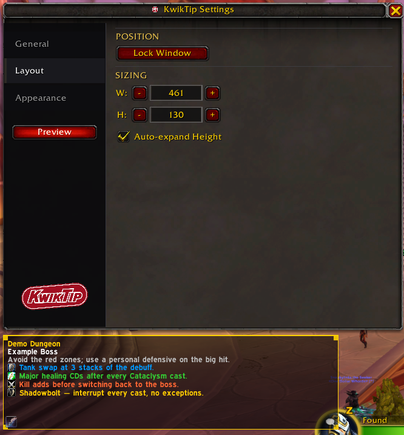
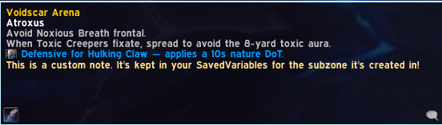
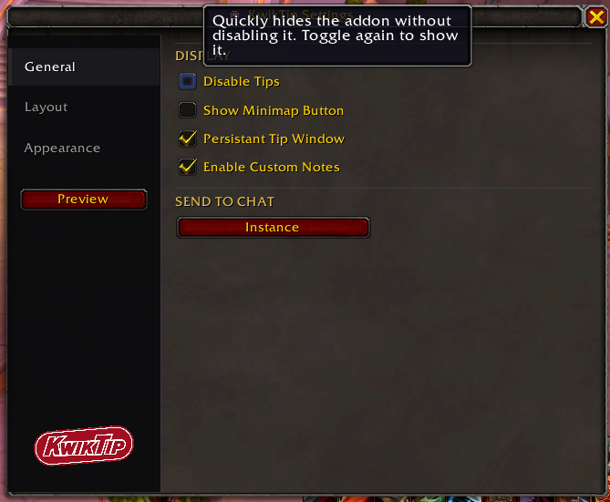

<p align="center">
  
</p>

<p align="center">
  World of Warcraft 12.0.1
</p>

A World of Warcraft: Midnight addon that displays contextual tips for dungeons and raids. As your group moves through an instance, KwikTip surfaces relevant boss and trash tips in a small, unobtrusive HUD — no interaction required mid-pull.

Inspired by **QE Dungeon Tips** by QEdev (no longer maintained).

**[Download on CurseForge](https://www.curseforge.com/wow/addons/kwiktip)** &nbsp;|&nbsp; **[Download on Wago](https://addons.wago.io/addons/kwiktip)** &nbsp;|&nbsp; **[Download on WoWInterface](https://www.wowinterface.com/downloads/info27074-KwikTip.html)**


---

## Screenshots

<p align="center">
  
</p>

<p align="center">
  
  &nbsp;&nbsp;
  
</p>

---

## Features

- **Boss tips** — concise, actionable guidance for every boss in the Season 1 M+ rotation
- **Sub-zone aware HUD** — the HUD updates automatically as your group moves through each area; boss room tips surface on entry before the encounter starts, and trash sections in supported dungeons get their own contextual tips
- **Role-specific notes** — tips are categorized by role (tank, healer, DPS, general) and interrupt priority, each with a distinct color and icon so you can find what's relevant at a glance
- **M+ affix display** — active keystone affix names and tips are shown in the HUD while waiting between encounters
- **Delve support** — boss tips for all Midnight delves
- **Custom notes** — save your own per-subzone notes that appear alongside tips in the HUD
- **Persistent Tip Window** — optionally keep the HUD visible throughout a run
- **Resizable, draggable HUD** — drag to reposition, drag corners to resize; locks in place when done
- **LibSharedMedia-3.0 support** — font picker lists all fonts registered by your other addons if LSM is present; falls back to three built-in WoW fonts otherwise

---

## Dungeon Coverage

All bosses across all listed dungeons have tips. Full area tip coverage — boss rooms and trash sections — is live for all eight Midnight dungeons and all four legacy M+ dungeons.

### Season 1 Mythic+ Rotation

| Dungeon | Type |
|---|---|
| Windrunner Spire | New — Midnight |
| Maisara Caverns | New — Midnight |
| Magisters' Terrace | New — Midnight (reworked) |
| Nexus-Point Xenas | New — Midnight |
| Algeth'ar Academy | Legacy |
| Pit of Saron | Legacy |
| Seat of the Triumvirate | Legacy |
| Skyreach | Legacy |

### Additional Midnight Dungeons

| Dungeon | Type |
|---|---|
| Murder Row | Level-up (81–88) |
| Den of Nalorakk | Level-up (81–88) |
| The Blinding Vale | Max level |
| Voidscar Arena | Max level |

### Delves

Boss tips for all Midnight delves.

---

## Installation

1. Download or clone this repository
2. Copy the `KwikTip` folder into your addons directory:
   ```
   World of Warcraft/_retail_/Interface/AddOns/KwikTip
   ```
3. Enable the addon in the WoW character select screen

---

## Usage

| Command | Action |
|---|---|
| `/kwiktip` or `/kwik` | Open/close settings |
| `/kwik move` | Toggle move mode (drag and resize the HUD) |
| `/kwik debug` | Print current instance detection state to chat |
| `/kwik debuglog` | Toggle map/mob ID logging to SavedVariables |
| `/kwik preview` | Toggle role notes preview in the HUD |
| `/kwik clearlog` | Clear all debug logs from SavedVariables |
| `/kwik feedback` | Print the feedback/issue link to chat |
| `/kwik help` | Print all available commands to chat |

The HUD is hidden outside of instances. Use `/kwik move` to show and reposition it at any time.

---

## Translations

The settings UI is fully localizable. Tip content intentionally stays in English — mechanical accuracy is critical and mistranslations could cost your group a key.

To contribute a translation for your language:

1. Log in to CurseForge
2. Go to the [KwikTip localization page](https://legacy.curseforge.com/wow/addons/kwiktip/localization)
3. Select your language and fill in the strings

Translations are pulled automatically into each release via the CurseForge packager.

